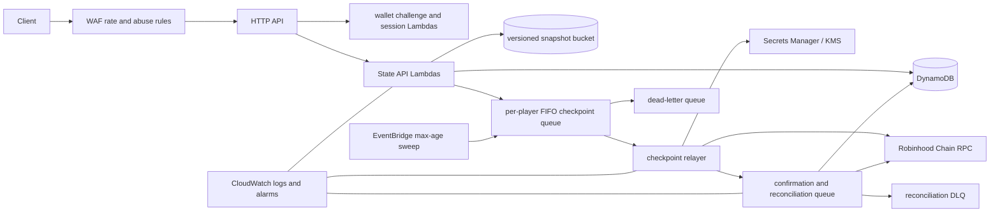

# Soulbound Scroll AWS infrastructure gate

This module provisions the persistence and checkpoint boundary for **Sherwood, the game (on robinhood chain)**. It never deploys during synthesis or tests.

## Deployment units

## Data stores

One DynamoDB table uses generic `pk`/`sk` keys and transactional conditional writes:

| Record | `pk` | `sk` | Purpose |
|---|---|---|---|
| Player | `PLAYER#<lower-wallet>` | `STATE` | Current canonical state, current version, checkpoint status |
| Amendment | `PLAYER#<lower-wallet>` | `AMEND#<20-digit-version>#<id>` | Append-only accepted command journal |
| Idempotency | `PLAYER#<lower-wallet>` | `IDEMP#<command-id>` | Command-result replay protection with TTL |
| Auth nonce | `AUTH#<lower-wallet>` | `NONCE#<nonce>` | One-use EIP-712 challenge with TTL and conditional consume |
| Session | `AUTH#<lower-wallet>` | `SESSION#<sha256-token>` | Opaque, expiring session; the raw token is never stored |
| Scroll | `SCROLL#<token-id>` | `PLAYER` | Immutable token-to-wallet mapping and mint transaction |
| Transaction | `TX#<transaction-hash>` | `CHECKPOINT` | Submission, replacement and confirmation state |

The snapshot bucket has versioning, KMS encryption, public access blocked, and object-lock-compatible immutable keys `players/<wallet>/v<version>/<root>.json`. Writes use `If-None-Match: *`; lifecycle policy may archive but never overwrite a snapshot.

## Queueing and batching

- A FIFO queue uses lower-case wallet as `MessageGroupId` and `<wallet>:<version>` as the deduplication id.
- Ordinary commands set a `checkpointDueAt` debounce deadline. Major milestones and optional match completion enqueue immediately.
- EventBridge invokes a sweep Lambda at a fixed cadence. The sweep finds players whose oldest uncheckpointed change exceeds the configured maximum age and enqueues their newest version.
- The relayer coalesces stale queue entries by reading the newest state, submits at most one root per wallet/version, and persists an idempotent transaction record before returning success.
- Failed queue entries reach a DLQ. CloudWatch alarms cover DLQ depth, API failures, signer failures, RPC outages, and unconfirmed transactions.

## Trust and network boundaries

- API Gateway, WAF, handler validation and session authorization form the untrusted internet boundary.
- Only server-side command handlers may create amendments. They load a rules engine through the state-core port and reject raw achievements, fineries, equipment ownership, experience or inventory awards.
- Lambdas run with service-specific IAM grants. The State API cannot read the relayer secret. The relayer can read only the named secret and use only the named KMS key.
- The checkpoint signer and relayer use separate private keys in a KMS-encrypted Secrets Manager JSON value. The checkpoint signer produces EIP-712 authorizations and the relayer alone submits them. Neither key is available to API Lambdas. A future KMS `ECC_SECG_P256K1` signer can replace this adapter without changing handlers.
- The relayer enforces a configured per-transaction gas ceiling and an atomic UTC-day sponsored-gas reservation before submission.
- RPC health is explicit. An outage leaves checkpoint work retryable and does not roll back already accepted off-chain game state.
- Admin mutation is outside this public API and is expected to be initiated by a multisig/timelock governance flow.

## Availability and consistency choices

Gameplay writes are strongly consistent in DynamoDB and use optimistic concurrency. Snapshot upload occurs before the state transaction commits its root pointer; orphaned immutable objects are harmless and can be inventoried. Chain state is eventually consistent and represented by a finite checkpoint status machine. Multiplayer verification fails closed for ranked progression: mismatches are quarantined, while guest/unranked play can continue without a Scroll.

## Operational risks and controls

- **Hot wallet groups:** per-wallet FIFO grouping preserves order while allowing parallel players.
- **RPC reorgs:** confirmations use a minimum depth; reconciliation can return a transaction to retry after a removed receipt.
- **Replacement races:** transaction records conditionally advance through `prepared -> submitted -> confirmed`; replacements reference the prior hash.
- **Signing-key compromise:** the key is isolated in Secrets Manager/KMS, spend is bounded, and contract relayer roles remain pausable/revocable.
- **PII/log leakage:** signatures, session tokens, secrets and full state bodies are never logged. Logs use request IDs and normalized resource identifiers.
