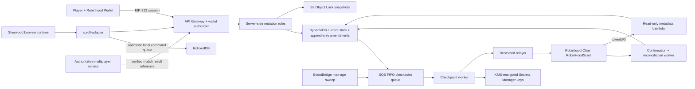

# Soulbound Scroll architecture gate

This document fixes the first implementation gate for **Sherwood, the game (on robinhood chain)**. It covers the architecture, contract boundary, data ownership, checkpoint lifecycle, and integration constraints before the backend implementation is considered complete.

## Decisions

- `RobinHoodScroll` is a non-upgradeable ERC-721. Avoiding a proxy makes the soulbound and payment rules inspectable and prevents an administrator from replacing them after mint.
- A wallet may mint at most one Scroll over its lifetime. Moving a Scroll does not clear the source wallet's consumed-mint marker.
- The `$ROBIN` contract, burn sink, and absolute price bounds are immutable deployment arguments. The burn sink must be `0x000000000000000000000000000000000000dEaD`; deployment rejects `0x1`, which is a precompile.
- The current mint price and upkeep treasury may change only through `TimelockController`. An emergency guardian can pause immediately; only the timelock can unpause.
- Every mint makes two exact `SafeERC20.safeTransferFrom` calls in one EVM transaction: 50% to upkeep and 50% to the dead address. Prices must be even in base units. Fee-on-transfer and rebasing `$ROBIN` deployments are unsupported unless exact recipient balance deltas can be proven.
- Detailed canonical progression is AWS-owned. The contract stores only the newest version, Merkle state root, and block timestamp.
- A checkpoint requires both an EIP-712 authorization from a `CHECKPOINT_SIGNER_ROLE` principal and submission by a `RELAYER_ROLE` principal. The typed message binds chain, contract, token, version, root, batch digest, nonce, and expiry.
- Achievement and finery events are optional bounded arrays attached to the same signed checkpoint transaction. There is never a transaction per award.
- Browser mutations are commands such as `claim_match_result`, `select_equipment`, and `submit_offline_run`; a raw state patch or client-authored award does not exist.
- Current state, append-only amendments, idempotency records, leases, and checkpoint status live in DynamoDB. Content-addressed immutable snapshots live in an S3 Object Lock bucket.
- A per-wallet SQS FIFO message group serializes checkpoint work. A five-minute debounce combines ordinary mutations, milestones can enqueue immediately, and an EventBridge sweep enforces a one-hour maximum uncheckpointed age.
- Testnet is the only deployment target described by executable scripts. No deployment runs automatically.

## Runtime view

## Trust boundaries and invariants

| Boundary | Untrusted input | Enforced invariant |
| --- | --- | --- |
| Wallet to auth API | Address, typed signature, nonce | Recovered signer equals lowercase path wallet; nonce is single-use and unexpired; domain, chain, and audience match. |
| Browser to state API | Mutation command, expected version, mutation ID | Schema validation, wallet authorization, idempotency, optimistic concurrency, and server rules run before state changes. |
| Multiplayer to state API | Match-result identifier | Only an authoritative server result can grant XP, achievements, finery, equipment, or unlocks. |
| DynamoDB to S3 | Canonical state and version | Snapshot key includes wallet, version, and canonical hash; Object Lock and versioning prevent mutation. |
| Queue to relayer | Token, root, version, batch digest | Per-player lease plus on-chain version and nonce prevent duplicates and stale submissions. |
| Signer to contract | EIP-712 checkpoint | Authorized signer, authorized relayer, deadline, nonce, and monotonic version all pass. |
| Governance to contract | Price, treasury, metadata, roles | Timelock is the only sensitive administrator; emergency pause cannot silently change economics. |
| Public readers to state | Wallet, token ID, proof selector | Detailed state requires a wallet session. Public summaries expose progression with an explicit verified flag; public proofs disclose only the requested member and hashes, never canonical JSON. Dirty metadata omits unverified level details. |

## Failure behavior

- Gameplay and local optimistic state continue during AWS or RPC outages.
- Canonical multiplayer entry uses only the last checkpoint-verified equipment and unlock set. Dirty or mismatched state is quarantined, not silently accepted.
- A stale write returns `409` with the newest server state. The adapter rebases only command types declared safe; other conflicts remain visible.
- SQS retries transient RPC and AWS failures with bounded exponential backoff. Exhausted messages enter a DLQ and raise an alarm.
- Submitted transactions are tracked by nonce and replacement history. Reconciliation distinguishes pending, replaced, reverted, confirmed, and chain-reorg states.
- The public Robinhood RPC is not treated as a production availability dependency. Production configuration uses an approved private provider; RPC failures remain retryable and never roll back accepted off-chain state.

## Existing-game integration boundary

The existing browser and room-server files are deliberately untouched. The UI session imports the API contracts from `packages/scroll-adapter/src/types.ts`, supplies the existing EIP-1193 wallet provider to `createScrollAdapter`, and renders `CheckpointStatus`. The authoritative room service later records a match result and gives the client only its opaque ID; the adapter submits that ID rather than reward fields.

## Delivery modules

| Module | Responsibility |
| --- | --- |
| `contracts/` | Solidity contract, timelock deployment, ABI, Foundry unit/fuzz/invariant tests. |
| `aws/state-core/` | Strict state schema, canonical JSON, keccak hashing, Merkle tree and proofs. |
| `aws/services/` | Auth, state, metadata, mint verification, multiplayer verification, checkpoint and reconciliation handlers. |
| `aws/infra/` | CDK constructs, least-privilege IAM, DynamoDB, S3, SQS, EventBridge, KMS, Secrets Manager, API and alarms. |
| `packages/scroll-adapter/` | Public API, immediate local projection, offline mutation queue, retries and conflict handling. |
| `docs/scroll/` | Contract/data schemas, economics, threat model, environment and runbooks. |
